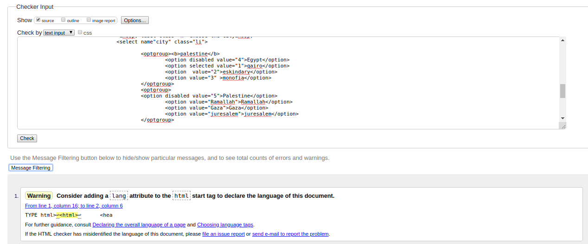
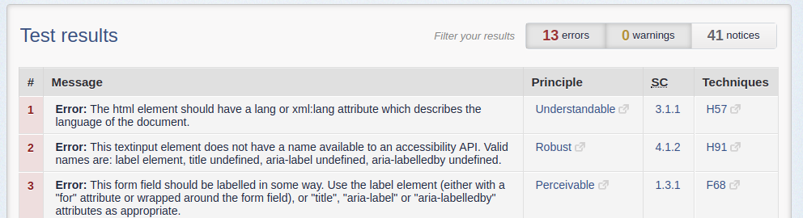
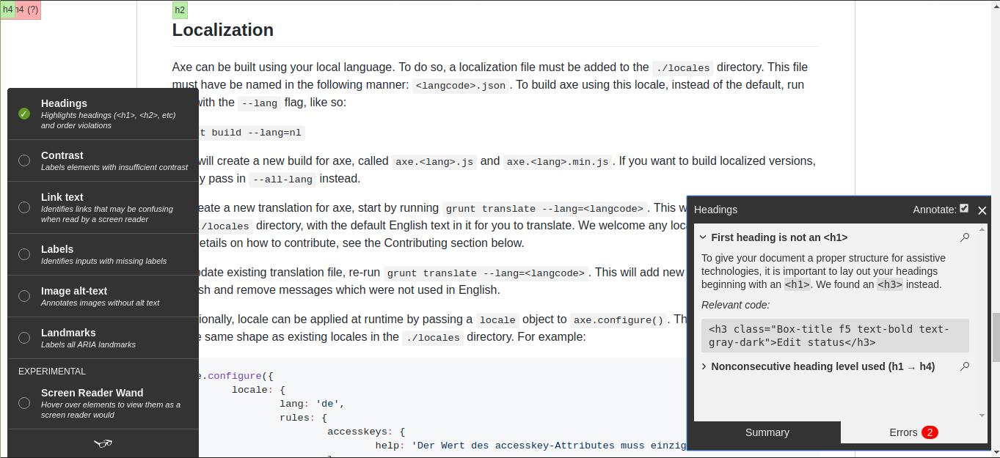

# Accessability :- 
## What is accessability ?!! 
### Examples of Web Accessability  :- 
- #### colors with good contrast 
- #### voice recognition 
- #### text to speach 
- #### notification && feedback 

## Accessibility Tools and extensions :
 1. #### HTML 5 outliner chrome extension :
    website: [HTML 5 outliner](https://chrome.google.com/webstore/detail/html5-outliner/afoibpobokebhgfnknfndkgemglggomo?hl=en)
    accessing every piece of content on the site using only your keyboard
    
 2. #### ChromeVox chrome extension :
    website:[ChromeVox](https://chrome.google.com/webstore/detail/chromevox/kgejglhpjiefppelpmljglcjbhoiplfn?hl=en)
    Go to website and try navigating around, using only your keyboard.
    
 3. #### Accessibility Developer Tools :
    website:[Accessibility Developer Tools](https://chrome.google.com/webstore/detail/accessibility-developer-t/fpkknkljclfencbdbgkenhalefipecmb?hl=en)
    ** Run an audit on your neighbour's website:
      - Open dev tools (as normal).
      - Click on the new "Audits" tab.
      - ... ;
 4. #### HTML validator :
    website: [HTML validator](https://validator.w3.org/nu/)
    
 5. #### HTML Code Sniffer :
    webSite : [Sniffer](http://squizlabs.github.io/HTML_CodeSniffer/)
    
 6. #### Tenon.io nice visual representations, and fairly thorough 85 issues found in
        [Google]( https://www.google.com/)
    website :[Tenon.io](Tenon.io)  

 7. #### WAVE Evaluation Tool- the chrome extension :
    website:[WAVE Evaluation Tool](https://chrome.google.com/webstore/detail/wave-evaluation-tool/jbbplnpkjmmeebjpijfedlgcdilocofh/related)     
      
 8. #### A11y Command-line Tools 
    you will need Node.js in order to install and use a11y on your machine.
    website: [A11y Command](https://addyosmani.com/a11y/)   


## Accessibility Navbar :

```
<html>
  <head>
    <title> Accessible Navbar</title>
  </head>
  <body>
    <nav albelledby='info'>
      <h2 id='info'>Informations</h2>
      <ul>
        <li><a herf="about">ABout us</a></li>
        <li><a herf="team">Our Team</a></li>
        <li><a herf="skills">Skills</a></li>
        <li><a herf="contect">Contect</a></li>
      </ul>
  </nav>
</body>
</html>
```


## How to write an accessible modal :
1. think about semantic HTML.
    - HTML5 elements standard with all important attripute.
    - use some app like ( photos ).
        1. Accessibility Developer Tools.
        2. html validator. 
        3. HTML Code Sniffer (website). 
        4. HTML 5 outliner --chrome extension.
        5. Tota11y. 
    - clean code.
2. Design site with CSS3 standards.
3. true color styling without contrast.
4. true text styling like weight or font family or font size to be easy to read.
5. dont forget the blind how need sound reading app might you need ChromeVox for page and who dont have keybord or mouse (--Putting yourself in someone else's shoes--).
