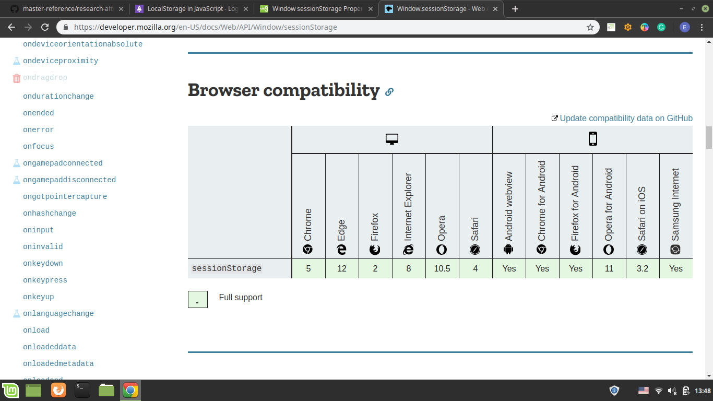

# Research Team:

- Sajeda
- Yosif
- Asem
- Fares

# Web Storage:

## What is the web storage:

In HTML5 and later,With web storage, web applications can store data locally within the user's browser.

## Web storage vs. cookies:

- Web Storage is more secure (cookies stored with every server requist).

- Web Storage provide larger space for the stored data(More than 5MB) .

- Web Storage doesnt affect the website Performance.

## Tow types of web Storage:

- ### Local Storge:

  Stores the data without expiration date, The data wont be lost if the browser is closed or if the page is opened in new tab.

- ### Session Storage:
  Stores data for only one session, The data is deleted when the user close the specific browser tab, or if the user open the page in other tab.

## Browsewrs Compatability:



### Note: Before using the web Storage objects you should check that the browser supports them:

```
if (typeof(Storage) !== "undefined") {
  // Code for localStorage/sessionStorage.
} else {
  // Sorry! No Web Storage support..
}
```

## The web Storage Objects functions:

The data is stored as a pair of (Key,value), with only string type.

- **setItem()**: Add key and value to webStorage Object.
- **getItem()**: Retrieve a value by the key from webStorage Object..
- **removeItem()**: Remove an item by key from webStorage Object.
- **clear():** Clear all data in a webStorage Object.
- **key()**: Passed a number to retrieve nth key of a webStorage Object.

##

```
// Store
sessionStorage.setItem("lastname", "Smith");

// Retrieve
document.getElementById("result").innerHTML = sessionStorage.getItem("lastname");

//Remove
sessionStorage.removeItem("lastname");

//clear
sessionStorage.clear();

//key
let KeyName =sessionStorage.key(index);

//

sessionStorage.key="value";

let value=sessionStorage.key;

```

# To store arrays or objects you would have to convert them to strings:

```
const person = {
    name: "Obaseki Nosa",
    location: "Lagos",
}
window.localStorage.setItem('user', JSON.stringify(person));
```

## To retrieve the user key stored above:

```
window.localStorage.getItem('user');
```

## This returns a string with value as:

```
“{“name”:”Obaseki Nosa”,”location”:”Lagos”}”

```

## To use this value, you would have convert it back to an object.

To do this, we make use of JSON.parse() method which converts a JSON string into a Javascript Object.

```
JSON.parse(window.localStorage.getItem('user'));

```

## LocalStorage JavaScript Limitations:

### As easy as it is to use LocalStorage, it is also easy to misuse it. The following are limitations and also ways to NOT use localStorage:

- Do not store sensitive user information in localStorage
- It is not a substitute for a server based database as information is only stored on the browser
- LocalStorage is limited to 5MB across all major browsers
- LocalStorage is quite insecure as it has no form of data protection and can be accessed by any code on your web page.
- LocalStorage is synchronous. Meaning each operation called would only execute one after the other.

#References:

- https://blog.logrocket.com/the-complete-guide-to-using-localstorage-in-javascript-apps-ba44edb53a36/

- https://www.w3schools.com/jsref/prop_win_sessionstorage.asp

- https://developer.mozilla.org/en-US/docs/Web/API/Window/sessionStorage
