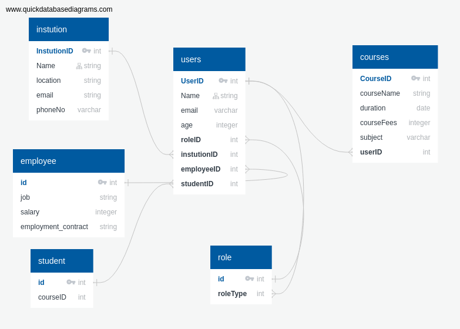

# What is a database schema

A database schema is a visual and logical architecture of a database.

- It provides a graphical view of the entire database architecture and structure.
- It provides a means for logically grouping and displaying database objects such as tables, fields, functions and relations.

# Why a database schema is important

1. ### Documentation

   The schema gives an overview of the data in the database which
   makes it easier to keep track of what information is and is not present in the database and what it represents,

2. ### Data integrity

   When taking care of the rules of each table and how should it be connected with the other and what shouldn't be connected

3. ### Storage and execution efficiency
   By knowing the size of data you will be storing in the database

# What is primary key ?? 
*  Is a field in a table which uniquely identifies    each row/record in a database table.
* Primary keys must contain unique values.
* A primary key column cannot have NULL values.

## When the primary key is called a composite key
* When a primary key consist of multiple fields.

## Create Primary Key

1- 
```

CREATE TABLE CUSTOMERS <br>
(ID SERIAL PRIMARY KEY, <br>
 NAME VARCHAR (20)
) 
 CREATE TABLE CUSTOMERS( <br>
   ID   INT NOT NULL,   <br>   
   NAME VARCHAR (20)     NOT NULL, <br>
   CONSTRAINT PK_CUSTID PRIMARY KEY (ID,Name)

)
```

2-  Use the ALTER TABLE statement

```


* ALTER TABLE CUSTOMERS ADD PRIMARY KEY (ID) 
* ALTER TABLE CUSTOMERS 
   ADD CONSTRAINT PK_CUSTID PRIMARY KEY (ID, NAME); 

```

```


CREATE TABLE CUSTOMERS( <br>
   ID   INT NOT NULL,   <br>   
   NAME VARCHAR (20)     NOT NULL, <br>

   PRIMARY KEY (ID) // example-1-<br>
   PRIMARY KEY (ID, NAME) // example-2-<br>
);

```

* NOTE − If you use the (ALTER TABLE statement) to add a primary key, the primary key column(s) should have already been declared to not contain NULL values


## How to DROP PRIMARY KEY ;

```


 ALTER TABLE CUSTOMERS DROP PRIMARY KEY

 ALTER TABLE CUSTOMERS
DROP CONSTRAINT PK_CUSTID

```

## Make a relations between table by using (primary & forign key )

```

CREATE TABLE CUSTOMERS( 
   id   INT NOT NULL,   
   name VARCHAR (20)     NOT NULL
); 

CREATE TABLE services ( <br>
  id_service SERIAL PRIMARY KEY,
  user_id INTEGER REFERENCES CUSTOMERS(id)
);

````

<br>

 ## websites to generate schemas :
* [dbdiagram](https://dbdiagram.io/home?utm_source=holistics&utm_medium=top_5_tools_blog)

</br>
 * [Draw](https://www.draw.io/) : 

* [Lucidchart](https://www.lucidchart.com/)

* [SQLDBM](https://www.sqldbm.com/)

* [QuickDBD](https://www.quickdatabasediagrams.com/)


## Example Scheme : 
### mock Schema for Founders and Coders
* Schema digram :


* Schema written on QuickDBD :  
```
instution
-
InstutionID PK int
Name string INDEX
location string
email  string
phoneNo varchar

users 
- 
UserID PK int
Name string INDEX
email varchar
age integer 
roleID int FK >- role.id
instutionID int FK >- instution.InstutionID
employeeID int Fk >- employee.id
studentID int FK >- student.id 

courses 
-
CourseID PK int
courseName string
duration date
courseFees integer
subject varchar
userID int FK >- users.UserID 

role 
- 
id pk int 
roleType int FK >- users.UserID  

student 
-
id pk int 
courseID int  

employee
- 
id PK int
job string 
salary integer 
employment_contract string

```

