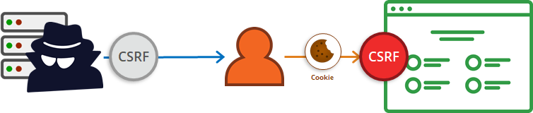

# Attacks 

## **What is attack (cyber attack) ?**
A cyber attack is any type of offensive action that targets computer information systems, infrastructures, computer networks or personal computer devices, using various methods to steal, alter or destroy data or information systems.

## **10 most common cyber attack types**

1- Denial-of-service (DoS) and distributed 
 denial-of-service (DDoS) attacks
> A denial-of-service attack system’s resources so that it cannot respond to service requests.   

2- Man-in-the-middle (MitM) attack  
> occurs when a hacker inserts itself between the communications of a client and a server. 

3- Phishing and spear phishing attacks  
>practice of sending emails that appear to be from trusted sources with the goal of gaining personal information or influencing  users to do something. It combines social engineering and technical trickery.

4- Drive-by attack  
> Hackers look for insecure websites and plant a malicious script into HTTP or PHP code on one of the pages. This script might install malware directly onto the computer of someone who visits the site, or it might re-direct the victim to a site controlled by the hackers.  
 
5- Password attack
> most commonly used mechanism to authenticate users to an information system, obtaining passwords is a common and effective attack approach.   

6- SQL injection attack
>common issue with database-driven websites. It occurs when a malefactor executes a SQL query to the database via the input data from the client to server.   

7- Cross-site scripting (XSS) attack
> third-party web resources to run scripts in the victim’s web browser

8- Eavesdropping attack
>occur through the interception of network traffic 

9- Birthday attack  
>made against hash algorithms that are used to verify the integrity of a message, software or digital signature.

10- Malware attack
>Malicious software can be described as unwanted software that is installed in your system without your consent.

# **Man in the middle attack (MITM)**
 ## What is MITM attack ?
 Is a general term for when a perpetrator positions himself in a conversation between a user and an application—either to eavesdrop or to impersonate one of the parties, making it appear as if a normal exchange of information is underway.


## The goal of an attack :
* Is to steal personal information, such as login credentials, account details and credit card numbers.

## MITM attack progression
- Successful MITM execution has two distinct phases: [interception] and [decryption].
 ### 1- Interception : 
 The first step intercepts user traffic through the attacker’s network before it reaches its intended destination.

 #### There are many ways of doing this stage :

 * The most common (and simplest) way is :<br>

  a passive attack in which an attacker makes free, malicious WiFi hotspots available to the public. Typically named in a way that corresponds to their location, they aren’t password protected. Once a victim connects to such a hotspot, the attacker gains full visibility to any online data exchange.

  * IP spoofing : <br>

  Involves an attacker disguising himself as an application by altering packet headers in an IP address. As a result, users attempting to access a URL connected to the application are sent to the attacker’s website.
  #### 	A packet header :<br>
  
   is the portion of an IP (Internet protocol) packet that precedes its body and contains addressing and other data that is required for it to reach its intended destination.

  ### 2- Decryption :

  After interception, any two-way SSL traffic needs to be decrypted without alerting the user or application. 
  
  #### There are many ways of doing this stage :

  * HTTPS spoofing : <br>

   Replace characters in the targeted site’s domain with other non-ASCII characters that are very similar in appearance. The attack exploits a feature called Punycode.<br> <br>
  
   Hackers register a domain name that is similar to the target website, and they also register its SSL certificate to make it look legitimate and secure. Then they send a link to their intended victim. Since most browsers support the display of punycode hostnames in their address bar, when the user browses to the address, they won’t notice that it is a bogus version of the site they expect to visit. Their browser even shows that the website’s certificate is legitimate and secure, further making it difficult to detect the attack.

  > Punycode :    
  A standard that enables the registration of hostnames that contain non-ASCII characters.

  ## **Man in the middle attack prevention :** 

  * One of the ways to prevent HTTPS spoofing is to disable punycode display support in your browser. This will make sure that the real, encoded domain name in the address bar and warn you if you’re visiting a non-authentic website.

  * Another protection against homographic attacks is to use a password manager. Password managers will automatically fill in the username and address boxes of websites when you’re visiting the legitimate domain. They’re not fooled by the looks of punycode representations.

  * Avoiding WiFi connections that aren’t password protected and also Not using public.

  * Paying attention to browser notifications reporting a website as being unsecured.

  * use SSL to secure every page of the site and not just the pages that require users to log in.It uses encryption algorithms to scramble data in transit, preventing hackers from reading it as it is sent over the connection. 


# **What is cross-site scripting (XSS)?**

Is a web security vulnerability that allows an attacker to compromise the interactions that users have with a vulnerable application. It allows an attacker to circumvent the same origin policy, which is designed to segregate different websites from each other.

- It allow an attacker to masquerade as a victim user.
- Carry out any actions that the user is able to perform.
- Access any of the user's data.

If the victim user has privileged access within the application, then the attacker might be able to gain full control over all of the application's functionality and data.

## **How does XSS work?**

- By manipulating a vulnerable web site so that it returns malicious JavaScript to users.
- When the malicious code executes inside a victim's browser, the attacker can fully compromise their interaction with the application.


## **What are the types of XSS attacks?**

There are three main types of XSS attacks. These are:

- Reflected XSS: where the malicious script comes from the current HTTP request.
- Stored XSS: where the malicious script comes from the website's database.
- DOM-based XSS: where the vulnerability exists in client-side code rather than server-side code.

## **How to prevent XSS attacks?**

- Filter input (Escaping and validating): At the point where user input is received, filter as strictly as possible based on what is expected or valid input.

- Encode data on output: At the point where user-controllable data is output in HTTP responses, encode the output to prevent it from being interpreted as active content. Depending on the output context, this might require applying combinations of HTML, URL, JavaScript, and CSS encoding.

- Use appropriate response headers: To prevent XSS in HTTP responses that aren't intended to contain any HTML or JavaScript, you can use the Content-Type and X-Content-Type-Options headers to ensure that browsers interpret the responses in the way you intend.

- Content Security Policy: As a last line of defense, you can use Content Security Policy (CSP) to reduce the severity of any XSS vulnerabilities that still occur.

# **Cross-Site Request Forgery**

**CSRF** attacks are also known by a number of other names, including:

- **XSRF**,
- **"Sea Surf"**,
- **Session Riding**,
- **Cross-Site Reference Forgery**,
- and **Hostile Linking**.

Microsoft refers to this type of attack as a **One-Click**

## Definition

Cross-Site Request Forgery (CSRF) is a type of attack that occurs when a malicious web site, email, blog, instant message, or program causes a user’s web browser to perform an unwanted action on a trusted site when the user is authenticated.

A CSRF attack works because browser requests automatically include any credentials associated with the site, such as the user's session cookie, IP address, etc.

Therefore, if the user is authenticated to the site, the site cannot distinguish between the forged or legitimate request sent by the victim.

In effect, CSRF attacks are used by an attacker to make a target system perform a function via the target's browser, without the user’s knowledge, at least until the unauthorized transaction has been committed.



## Impact

The impact of a successful CSRF attack is limited to the capabilities exposed by the vulnerable application.

**For example**, this attack could result in a transfer of funds, changing a password, or making a purchase with the user’s credentials.

**Impacts of successful CSRF exploits vary greatly based on the privileges of each victim**

Using social engineering, an attacker can embed malicious HTML or JavaScript code into an email or website to request a specific 'task URL'. The task then executes with or without the user's knowledge, either directly or by using a Cross-Site Scripting flaw.

### What is social engineering

**Social engineering** is the term used for a broad range of malicious activities accomplished through human interactions. It uses psychological manipulation to trick users into making security mistakes or giving away sensitive information.

## Example

As an example, my banking website, example.com, does not protect itself against CSRF. You, an unsuspecting example.com user, also happened to be logged in to example.com. Now, malicious user Mallory sends you (and millions of other example.com users, of course) an HTML e-mail including the following tag.

```html

```

If you have a webmail client that loads images automatically, the transfer request will be made from your browser using your IP address and your example.com session cookies, exactly as if you made the request yourself. My bank website, therefore, treats this like a legitimate request and sends \$1000 from your account to Mallory’s account. All evidence suggests you legitimately made this transaction from your logged-in browser.

If all actions on my site are vulnerable to CSRF, this could even lead to further damage. If the attacker can forge a password reset request, or an e-mail change request, the attacker could subsequently gain full control of the victim’s account. If the victim is an administrative user, the entire website would be under the attacker’s control.

## Prevention measures that do NOT work

### Using a secret cookie

**Why**: All cookies, even the secret ones, will be submitted with every request

### Multi-Step Transactions:

**Why** : Attacker can predict or deduce each step of the completed transaction, then CSRF is possible.

### URL Rewriting:

**Why** : The user’s session ID is exposed in the URL. We don't recommend fixing one security flaw by introducing another.

### HTTPS:

**Why** : HTTPS should be considered a prerequisite for any preventative measures to be trustworthy.

## **How to prevent CSRF**

### Implement an Anti-CSRF Token
  An anti-CSRF token is a type of CSRF protection. It is a random string that is only known by the user’s browser and the web application. The anti-CSRF token is usually stored inside a session variable. It is typically on a page inside a hidden form field which is sent together with the request.

  If the value of the session variable and the hidden form field match, the web application accepts the request. If they do not match the request is dropped. Since in this case, the attacker does not know the exact value of the hidden form field that is needed for the request to be accepted, he cannot launch a CSRF attack.

### Use the Same-Site Flag in Cookies
  The Same-Site Flag in Cookies is a relatively new method that is being used to prevent CSRF attacks and improve web application security. In the above scenario, we saw that https://attacker.com/could send a POST request to https://example.com/ together with a session cookie. This session cookie is unique for every user and the web application uses it to distinguish different users from each other, and to determine if you are logged in.  

  ### Example
```
<form action="/transfer.do" method="post">

<input type="hidden" name="CSRFToken"
value="OWY4NmQwODE4ODRjN2Q2NTlhMmZlYWEwYzU1YWQwMTVhM2JmNGYxYjJiMGI4MjJjZDE1ZDZMGYwMGEwOA==">
...
</form>
```

# **Conclusion**

* Mounting a good defense requires understanding the offense. 

* Measures to mitigate these threats vary, but security basics stay the same:    
1- Keep your systems and anti-virus databases up to date.  
2- train your employees  
3- configure your firewall to whitelist only the specific ports and hosts you need.  
4- keep your passwords strong.  
5- make regular backups.  
6- continuously audit your IT systems for suspicious activity.  
7- use a least-privilege model in your IT environment.  
>privilege is defined as the delegation of authority to perform security-relevant functions on a computer system 
